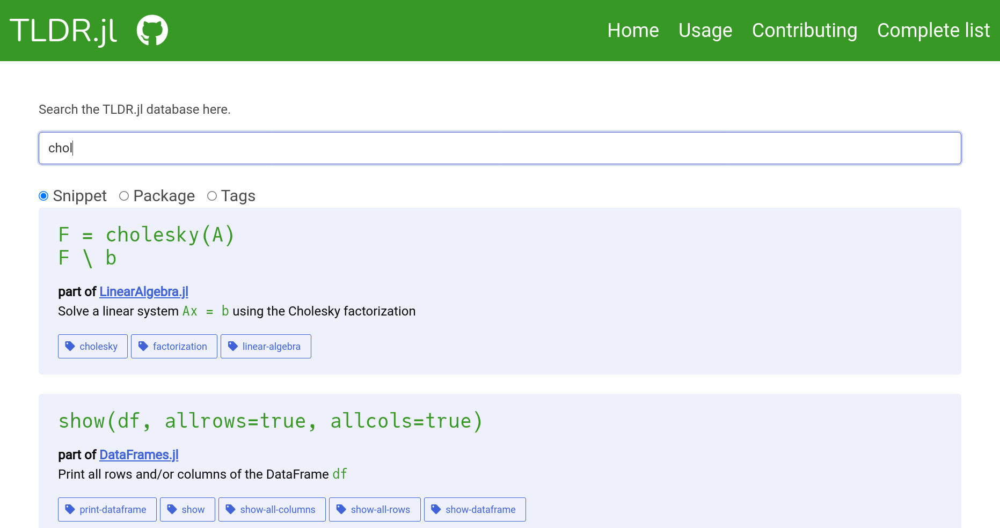

# TLDR
<!-- ALL-CONTRIBUTORS-BADGE:START - Do not remove or modify this section -->

<!-- ALL-CONTRIBUTORS-BADGE:END -->

_A package for fast help and snippets, for when you don't want to search the docs._

TLDR means Too Long, Didn't Read. This package is inspired by [tldr-pages](https://tldr.sh), but focused on Julia. They probably don't overlap.

**Work in progress, let me know your opinion**

---

I have created a proof-of-concept of the search online: https://abelsiqueira.github.io/TLDR.jl/

Here's a sneak peak:

## Contributors ✨

Thanks goes to these wonderful people ([emoji key](https://allcontributors.org/docs/en/emoji-key)):

<!-- ALL-CONTRIBUTORS-LIST:START - Do not remove or modify this section -->
<!-- prettier-ignore-start -->
<!-- markdownlint-disable -->
<table>
  <tr>
    <td align="center"><a href="http://abelsiqueira.github.io"> <b>Abel Siqueira</b></a> <a href="https://github.com/abelsiqueira/TLDR.jl/commits?author=abelsiqueira" title="Code">💻</a></td>
  </tr>
</table>

<!-- markdownlint-restore -->
<!-- prettier-ignore-end -->

<!-- ALL-CONTRIBUTORS-LIST:END -->

This project follows the [all-contributors](https://github.com/all-contributors/all-contributors) specification. Contributions of any kind welcome!